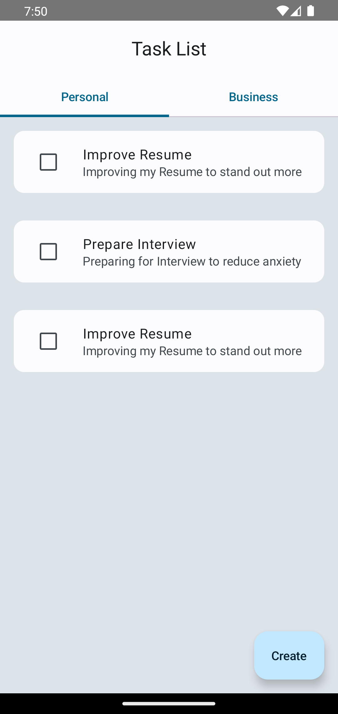

# Taskify Android App [Work in progress 🚧]

Taskify is an Android application built entirely with Kotlin and Jetpack Compose, utilizing SQLDelight for local-only database management. This app provides a simple and efficient way to manage your personal and business tasks.

The app is currently in early development and unavailable on the Play Store.

## Features

- **Jetpack Compose**: Modern UI toolkit for building native Android UI.
- **Kotlin**: A modern programming language that makes Android development faster and more enjoyable.
- **SQLDelight**: A Kotlin Multiplatform database library that provides a type-safe API to interact with an SQLite database, for local-only storage.
- **Task Creation**: Quickly add new tasks to stay organized.
- **Task Editing**: Easily edit tasks to update their details.
- **Task Deletion**: Effortlessly delete tasks you no longer need.
- **Task Prioritization**: Assign priorities to tasks to manage your workflow effectively.
- **Dark Mode (System)**: Supports system-level dark mode settings for comfortable viewing.
- **Glance Widgets**: View tasks at a glance with home screen widgets.

## Screenshots



## Installation

To get a local copy up and running, follow these simple steps.

### Prerequisites

- Android Studio
- Kotlin 2.0+
- Android SDK 35

### Clone the repository

```sh
git clone https://github.com/iNoles/TaskList.git
```

### Open the project in Android Studio

- Open Android Studio.
- Click on File -> Open....
- Navigate to the directory where you cloned the project and select it.
- Click on Open.

### Build and Run

- Ensure you have an Android device connected or an emulator running.
- Click on the Run button in Android Studio.

## Contributing

Contributions are what make the open-source community such an amazing place to be, learn, inspire, and create. Any contributions you make are greatly appreciated.

- Fork the project.
- Create your feature branch (git checkout -b feature/AmazingFeature).
- Commit your changes (git commit -m 'Add some AmazingFeature').
- Push to the branch (git push origin feature/AmazingFeature).
- Open a Pull Request.
