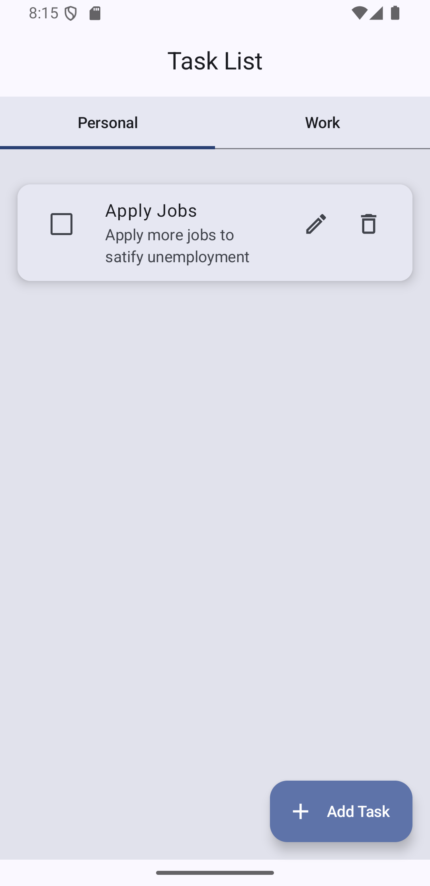
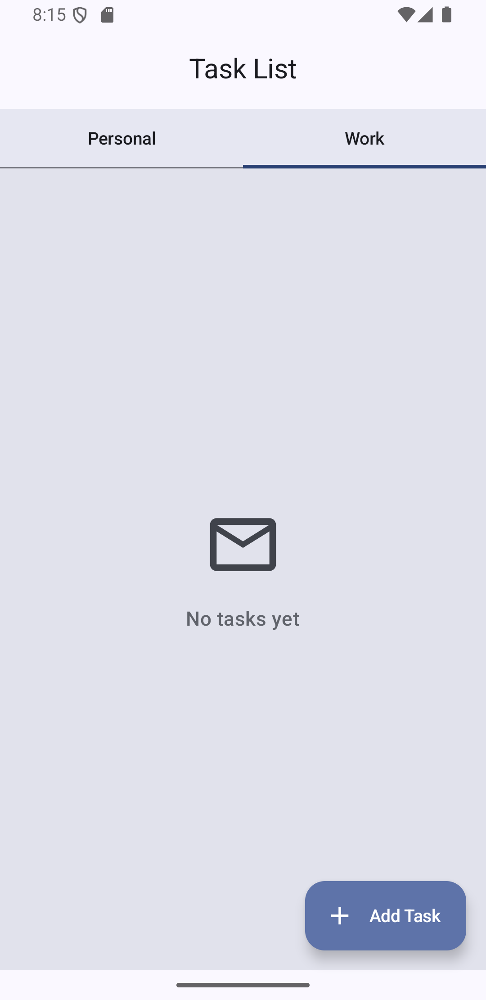

# Taskify 📋

A simple yet powerful task management app for personal and business use, built with Jetpack Compose and Room Database. Taskify allows users to efficiently create, manage, and organize their tasks.

## 🚀 Features

- 📝 Task Creation & Management – Easily add, edit, and delete tasks.
- 📆 Due Dates & Prioritization – Organize tasks based on priority and deadlines.
- ✅ Task Completion Tracking – Mark tasks as completed.
- 📂 Multiple Task Lists – Categorize tasks into different lists for better organization.
- 🌙 Material 3 Design – Modern UI with Material You styling.

## 🛠️ Technologies Used

- Kotlin – Primary language
- Jetpack Compose – UI framework
- Room Database – Local database for storing tasks
- Koin – Dependency injection
- Navigation Component – Seamless navigation between screens

## 📦 Installation

1. Clone the repository:

```sh
git clone https://github.com/iNoles/Taskify
cd Taskify
```

2. Open in **Android Studio**.
3. Sync Gradle dependencies.
4. Run the app on an emulator or physical device.

## 📸 Screenshots




## Contributing

Contributions are what make the open-source community such an amazing place to be, learn, inspire, and create. Any contributions you make are greatly appreciated.

1. Fork the project.
2. Create your feature branch (`git checkout -b feature/AmazingFeature`).
3. Commit your changes (`git commit -m 'Add some AmazingFeature'`).
4. Push to the branch (`git push origin feature/AmazingFeature`).
5. Open a Pull Request.
